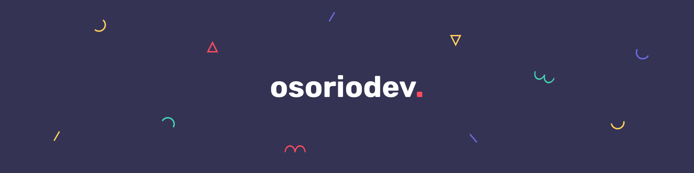

# Hey there, I'm David 👋

I'm a Front-End developer, based in Mexico. I spend my time coding things that live on the web. Here you can find all my projects and things that I have built.

## You can find me on:

&nbsp;
&nbsp;
&nbsp;
&nbsp;

## About me

I started to venture into the world of programming several years ago and after trying different branches, I found my place on the web. Currently I dedicate myself to creating projects where I put my knowledge and skills to the test. My goal is to create enjoyable interactions and experiences for everyone, so I focus on topics like accessibility, optimization, and performance.

## Technologies & Tools

&nbsp;
&nbsp;
&nbsp;
&nbsp;
&nbsp;
&nbsp;
&nbsp;
&nbsp;
&nbsp;
&nbsp;
&nbsp;
&nbsp;
&nbsp;
&nbsp;
&nbsp;
&nbsp;
&nbsp;
&nbsp;
&nbsp;
&nbsp;

## GitHub Stats

